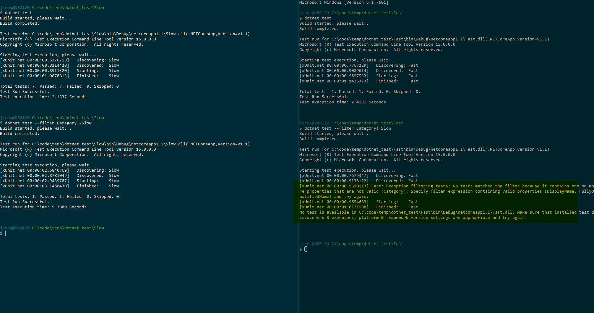

#Update 2018

After updating to Microsoft.NET.Test.Sdk >=15.5 error is gone. Related discussions: 
https://github.com/xunit/xunit/issues/1314
https://github.com/Microsoft/vstest/pull/845

# Overview

This is a minimal sample to demonstrate an issue with the dotnet test tooling when using `--filter` to exclude xunit tests with a particular trait using dotnet version 1.0.3 and xunit 2.2.0.

### Steps to reproduce

1. Create a new test project with one test
2. Run `dotnet test --filter Category!=Slow`

### Actual Results

We receive an error from the command line:

```
Exception filtering tests: No tests matched the filter because it contains
one or more properties that are not valid (Category). Specify filter expression
containing valid properties (DisplayName, FullyQualifiedName) and try again.
```

### Expected Results

We expect the test runner to run any tests that are not decorated with `[Trait("Category", "Slow")]` (since these tests don't match the filter).

# Example

This repository contains two projects: Fast and Slow.

The Fast project contains a single tests without trait decoration.

The Slow repository contains one test and one theory. The theory is decorated with `[Trait("Category", "Slow")]`.

If we run `dotnet test --filter Category!=Slow` on the slow assembly then the test that does not have this trait is executed successfully (which is what we'd expect, since it doesn't match the exclusion filter). However running the same on the fast assembly produces an error.


